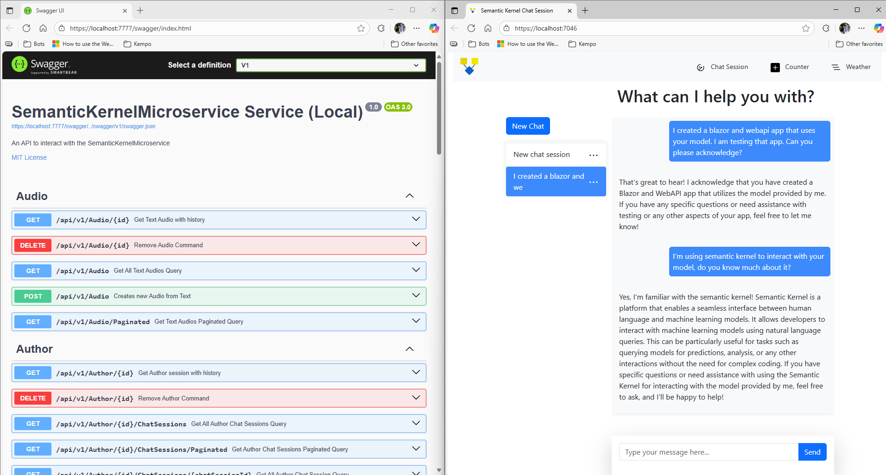

# Semantic Kernel C# Microservice Quick-Start
**Azure Bicep Infrastucture**

[](https://github.com/goodtocode/semantickernel-microservice/actions/workflows/gtc-rg-semkernel-iac.yml)

**Clean Architecture C# Microservice**

[](https://github.com/goodtocode/semantickernel-microservice/actions/workflows/gtc-rg-semkernel-api-ci-cd.yml)

Semantic Kernel Quick-start is a .NET Web API CRUD Microservice solution with Blazor Copilot-ish Chat client that demonstrates the most basic use cases of the Microsoft Semantic Kernel in a Clean Architecture C# Microservice. This microservice allows you to persist the following Azure Open AI services to SQL Server, so you can replay messages and maintain history of your interaction with AI. 



Semantic Kernel is an SDK that integrates Large Language Models (LLMs) like OpenAI, Azure OpenAI, and Hugging Face with conventional programming languages like C#, Python, and Java. Semantic Kernel allows developers to define plugins that can be chained together in just a few lines of code.

[Introduction to Semantic Kernel](https://learn.microsoft.com/en-us/semantic-kernel/overview/)

[Getting Started with Semantic Kernel](https://learn.microsoft.com/en-us/semantic-kernel/get-started/quick-start-guide?pivots=programming-language-csharp)

This microservice supports:
* Chat Completions: Generate responses based on user input, making it useful for chatbots and virtual assistants.
* Text to Speech: Convert text into natural-sounding speech, enhancing user experiences.
* Whisper (Text to Speech): Convert spoken language into text, useful for transcription and voice recognition.
* Image to Text: Generate descriptions of an image.
* Text to Image: Create an image based on a description prompt of the desired imagery.

Upcoming relases will support more Semantic Kernel and Azure Open AI functionality such as:
* Embeddings: Create vector representations of text, which can be used for semantic search and similarity matching.
* Function Calling: Integrate custom functions into your AI models, allowing the model to call external APIs or perform specific tasks based on the context of the conversation.
* Content Filtering: Automatically filter out inappropriate or harmful content from generated responses.
* Fine-Tuning: Train models on your specific data to better align with your use cases and improve performance.
* Assistants: Create and manage virtual assistants that can handle complex tasks and interactions.
* Semantic Search: Perform searches based on the meaning of the text rather than just keywords, improving search relevance.

# Getting-Started in 4 Steps
To get started, follow the steps below:
1. Clone this repository
	```
	git clone https://github.com/goodtocode/semantickernel-microservice.git
	```
2. Install Prerequisites
	```
	winget install Microsoft.DotNet.SDK.9 --silent
	```
	```
	dotnet tool install --global dotnet-ef
	```
3. Add your Open AI or Azure Open AI key to configuration (via *dotnet user-secrets set* command)
	```
	cd src/Presentation.WebAPI
	dotnet user-secrets set "OpenAI:ApiKey" "YOUR_API_KEY"
	```
	```
	cd ../Tests.Specs.Integration
	dotnet user-secrets set "OpenAI:ApiKey" "YOUR_API_KEY"
	```
4. Create your SQL Server database & schema (via *dotnet ef* command)
	```
	cd ../../
	dotnet ef database update --project .\src\Infrastructure.SqlServer\Infrastructure.SqlServer.csproj --startup-project .\src\Presentation.WebApi\Presentation.WebApi.csproj --context SemanticKernelContext --connection "Data Source=(localdb)\MSSQLLocalDB;Initial Catalog=SemanticKernelMicroservice;Min Pool Size=3;MultipleActiveResultSets=True;Trusted_Connection=Yes;TrustServerCertificate=True;MultipleActiveResultSets=False;Encrypt=True;TrustServerCertificate=False;Connection Timeout=30"
	```
5. Run Tests (Tests.Specs.Integration)
	```
	cd src/Tests.Specs.Integration
	dotnet test
	```
6. Run Blazor Web Chat Client (Presentation.Blazor) and Web API (Presentation.WebApi)
	```
	cd ../
	dotnet run --project Presentation.WebApi/Presentation.WebApi.csproj
	dotnet run --project Presentation.Blazor/Presentation.Blazor.csproj
	```

# Install Prerequisites
You will need the following tools:
## Visual Studio
[Visual Studio Workload IDs](https://learn.microsoft.com/en-us/visualstudio/install/workload-component-id-vs-community?view=vs-2022&preserve-view=true)
```
winget install --id Microsoft.VisualStudio.2022.Community --override "--quiet --add Microsoft.Visualstudio.Workload.Azure --add Microsoft.VisualStudio.Workload.Data --add Microsoft.VisualStudio.Workload.ManagedDesktop --add Microsoft.VisualStudio.Workload.NetWeb"
```

## .NET SDK
```
winget install Microsoft.DotNet.SDK.9 --silent
```

## dotnet ef cli
Install
```
dotnet tool install --global dotnet-ef
```

## SQL Server
Visual Studio installs SQL Express. If you want full-featured SQL Server, install the SQL Server Developer Edition or above.

[SQL Server Developer Edition or above](https://www.microsoft.com/en-us/sql-server/sql-server-downloads)

# Configure API Key and Connection String
Follow these steps to get your development environment set up:

## ASPNETCORE_ENVIRONMENT set to "Local" in launchsettings.json
1. This project uses the following ASPNETCORE_ENVIRONMENT to set configuration profile
- Debugging uses Properties/launchSettings.json
- launchSettings.json is set to Local, which relies on appsettings.Local.json
2. As a standard practice, set ASPNETCORE_ENVIRONMENT entry in your Enviornment Variables and restart Visual Studio
	```
	Set-Item -Path Env:ASPNETCORE_ENVIRONMENT -Value "Development"
	Get-Childitem env:
	```	
  
## Setup Azure Open AI or Open AI configuration
**Important:** Do this for both Presentation.WebAPI and Specs.Infrastructure
### Azure Open AI
```
cd src/Presentation.WebAPI
dotnet user-secrets set "AzureOpenAI:ChatDeploymentName" "gpt-4"
dotnet user-secrets set "AzureOpenAI:Endpoint" "https://YOUR_ENDPOINT.openai.azure.com/"
dotnet user-secrets set "AzureOpenAI:ApiKey" "YOUR_API_KEY"
cd src/Tests.Specs.Integration
dotnet user-secrets set "AzureOpenAI:ChatDeploymentName" "gpt-4"
dotnet user-secrets set "AzureOpenAI:Endpoint" "https://YOUR_ENDPOINT.openai.azure.com/"
dotnet user-secrets set "AzureOpenAI:ApiKey" "YOUR_API_KEY"
```
Alternately you can set in Environment variables
```
AzureOpenAI__ChatDeploymentName
AzureOpenAI__Endpoint
AzureOpenAI__ApiKey
```

### Open AI
Set API Key in both Presention.WebAPI and Tests/Specs.Integration projects
```
cd src/Presentation.WebAPI
dotnet user-secrets set "OpenAI:ApiKey" "YOUR_API_KEY"
cd ../Tests.Specs.Integration
dotnet user-secrets set "OpenAI:ApiKey" "YOUR_API_KEY"
```
Alternately you can set in Environment variables
```
OpenAI__ChatModelId	
OpenAI__ApiKey
```

## Setup your SQL Server connection string
```
dotnet user-secrets init
dotnet user-secrets set "ConnectionStrings:DefaultConnection" "YOUR_SQL_CONNECTION_STRING"
```
# Create SQL Server Database
## dotnet ef migrate steps

1. Open Windows Terminal in Powershell or Cmd mode
2. cd to root of repository
3. (Optional) If you have an existing database, scaffold current entities into your project
	
	```
	dotnet ef dbcontext scaffold "Data Source=localhost;Initial Catalog=semantickernelmicroservice;Min Pool Size=3;MultipleActiveResultSets=True;Trusted_Connection=Yes;TrustServerCertificate=True;" Microsoft.EntityFrameworkCore.SqlServer -t WeatherForecastView -c WeatherChannelContext -f -o WebApi
	```

4. Create an initial migration
	```
	dotnet ef migrations add InitialCreate --project .\src\Infrastructure.SqlServer\Infrastructure.SqlServer.csproj --startup-project .\src\Presentation.WebApi\Presentation.WebApi.csproj --context SemanticKernelContext
	```

5. Develop new entities and configurations
6. When ready to deploy new entities and configurations
   
	```	
	dotnet ef database update --project .\src\Infrastructure.SqlServer\Infrastructure.SqlServer.csproj --startup-project .\src\Presentation.WebApi\Presentation.WebApi.csproj --context SemanticKernelContext --connection "Data Source=(localdb)\MSSQLLocalDB;Initial Catalog=SemanticKernelMicroservice;Min Pool Size=3;MultipleActiveResultSets=True;Trusted_Connection=Yes;TrustServerCertificate=True;MultipleActiveResultSets=False;Encrypt=True;TrustServerCertificate=False;Connection Timeout=30"
	```
7. When an entity changes, is created or deleted, create a new migration. Suggest doing this each new version.
	```
	dotnet ef migrations add v1.1.1 --project .\src\Infrastructure.SqlServer\Infrastructure.SqlServer.csproj --startup-project .\src\Presentation.WebApi\Presentation.WebApi.csproj --context SemanticKernelContext
	```
# Running the Application
## Launch the backend
Right-click Presentation.WebApi and select Set as Default Project
```
dotnet run Presentation.WebApi.csproj
```

## Open http://localhost:7777/swagger/index.html 
Open Microsoft Edge or modern browser
Navigate to: http://localhost:7777/swagger/index.html in your browser to the Swagger API Interface


# DevOps Configuration for Azure IaC and CI/CD
## GitHub Actions (.github folder)
The GitHub action will automatically run upon commit to a repo. The triggers are set based on changes (PRs/Merges) to the main branch.

### Azure Federation to GitHub Actions
gtc-rg-semantickernel-infrastructure.yml will deploy all necessary resources to Azure. To enable this functionality, two service principles are required: App Registration service principle (used for az login command) and a Enterprise Application service principle (allows GitHub to authenticate to Azure).
#### Git Hub Environment Secret setup and Azure IAM privileges: 
Note: The AZURE_SECRETS method uses: az ad sp create-for-rbac --name "COMPANY-SUB_OR_PRODUCTLINE-github-001" --role contributor --scopes /subscriptions/SUBSCRIPTION_ID --json-auth

[New-AzureGitHubFederation.ps1](https://github.com/goodtocode/cloud-admin/blob/main/scripts/cybersecurity/Azure-GitHub-Federation/New-AzureGitHubFederation.ps1)
```
Install-Module Az #-Force #Force will update the module if it is already installed

Connect-AzAccount -SubscriptionId $SubscriptionId -UseDeviceAuthentication
```
```
# Create a new Azure AD App Registration application and service principal
$existingAppRegistration = Get-AzADApplication -Filter "displayName eq '$PrincipalName'"
if (-not $existingAppRegistration) {
    New-AzADApplication -DisplayName $PrincipalName
}
$clientId = (Get-AzADApplication -DisplayName $PrincipalName).AppId

New-AzADServicePrincipal -ApplicationId $clientId
$objectId = (Get-AzADServicePrincipal -DisplayName $PrincipalName).Id

New-AzRoleAssignment -ObjectId $objectId -RoleDefinitionName Contributor -Scope "/subscriptions/$SubscriptionId"
$clientId = (Get-AzADApplication -DisplayName $PrincipalName).AppId
$tenantId = (Get-AzContext).Subscription.TenantId
```
```
# Create new App Registration Federated Credentials for the GitHub operations
$subjectRepo = $subjectRepo = "repo:" + $Organization + "/" + $Repository + ":environment:" + $Environment

New-AzADAppFederatedCredential -ApplicationObjectId $objectId -Audience api://AzureADTokenExchange -Issuer 'https://token.actions.githubusercontent.com' -Name "$PrincipalName-repo" -Subject "$subjectRepo"
$subjectRepoMain = "repo:" + $Organization + "/" + $Repository + ":ref:refs/heads/main"

New-AzADAppFederatedCredential -ApplicationObjectId $objectId -Audience api://AzureADTokenExchange -Issuer 'https://token.actions.githubusercontent.com' -Name "$PrincipalName-main" -Subject "$subjectRepoMain"
$subjectRepoPR = "repo:" + $Organization + "/" + $Repository + ":pull_request"

New-AzADAppFederatedCredential -ApplicationObjectId $objectId -Audience api://AzureADTokenExchange -Issuer 'https://token.actions.githubusercontent.com' -Name "$PrincipalName-PR" -Subject "$subjectRepoPR"
```
In GitHub repo environment: Add the az login secrets: 
- AZURE_CLIENT_ID
- AZURE_TENANT_ID
- AZURE_SUBSCRIPTION_ID

## Azure DevOps Pipelines (.azure-devops folder)
Azure DevOps pipelines require an Azure Service Connection to authenticate and deploy resources to Azure.

# Entity Framework vs. Semantic Kernel Memory
This example uses Entity Framework (EF) to store messages and responses for Semantic Kernel, and does not rely on SK Memory (SM). EF and SM serve different purposes. If you need natural language querying and efficient indexing, Semantic Kernel Memory is a great fit. If you’re building a standard application with a relational database, Entity Framework is more appropriate.

The key differences between Entity Framework (EF) and Semantic Kernel memory:

## Purpose and Functionality
- Entity Framework (EF): EF is an Object-Relational Mapping (ORM) framework for .NET applications. It allows you to map database tables to C# classes and provides an abstraction layer for database operations. EF focuses on CRUD (Create, Read, Update, Delete) operations and data modeling.
- Semantic Kernel Memory: Semantic Kernel Memory (SM) is part of the Semantic Kernel project. It’s a library for C#, Python, and Java that wraps direct calls to databases and supports vector search. SM is designed for long-term memory and efficient indexing of datasets. It’s particularly useful for natural language querying and retrieval augmented generation (RAG).

## Data Storage and Retrieval
- EF: EF stores data in relational databases (e.g., SQL Server, MySQL, PostgreSQL). It uses SQL queries to retrieve data.
- SM: SM can use various storage mechanisms, including vector databases. It supports vector search, which allows efficient similarity-based retrieval. SM is well-suited for handling large volumes of data and complex queries.

## Querying
- EF: EF queries are typically written in LINQ (Language Integrated Query) or SQL. You express queries in terms of C# objects and properties.
- SM: SM supports natural language querying. You can search for information using text-based queries, making it more user-friendly for applications like chatbots.

## Integration with Chat Systems
- EF: EF doesn’t directly integrate with chat systems. It’s primarily used for data persistence.
- SM: SM integrates seamlessly with chat systems like ChatGPT, Copilot, and Semantic Kernel. It enhances data-driven features in AI applications.

## Scalability and Performance
- EF: EF is suitable for small to medium-sized applications. It may not perform optimally with very large datasets.
- SM: SM is designed for scalability. It can handle large volumes of data efficiently, making it suitable for memory-intensive applications.

## Use Cases
- EF: Use EF for traditional CRUD operations, business logic, and data modeling.
- SM: Use SM for long-term memory, chatbots, question-answering systems, and information retrieval.

# Contact
* [GitHub Repo](https://www.github.com/goodtocode/templates)
* [@goodtocode](https://www.twitter.com/goodtocode)
* [github.com/goodtocode](https://www.github.com/goodtocode)

# Technologies
* [ASP.NET .Net](https://docs.microsoft.com/en-us/aspnet/core/introduction-to-aspnet-core)
* [Entity Framework Core](https://docs.microsoft.com/en-us/ef/core/)

# Semantic Kernel
* [GitHub](https://github.com/microsoft/semantic-kernel.git)
* [Getting Started Blog](https://devblogs.microsoft.com/semantic-kernel/how-to-get-started-using-semantic-kernel-net/)
* [Understanding the Kernel](https://learn.microsoft.com/en-us/semantic-kernel/agents/kernel/?tabs=Csharp)
* [Creating Plugins](https://devblogs.microsoft.com/semantic-kernel/using-semantic-kernel-to-create-a-time-plugin-with-net/)

## Additional Technologies References
* AspNetCore.HealthChecks.UI
* Entity Framework Core
* Microsoft.AspNetCore.App
* Microsoft.AspNetCore.Cors
* Swashbuckle.AspNetCore.SwaggerGen
* Swashbuckle.AspNetCore.SwaggerUI

# Version History

| Version | Date        | Release Notes                             |
|---------|-------------|-------------------------------------------|
| 1.0.0   | 2024-Aug-05 | Initial WebAPI Release                    |
| 1.0.1   | 2024-Oct-27 | Updated Azure IaC ESA/CAF Standards       |
| 1.0.2   | 2025-Jan-19 | Updated to .NET 9 and SK 1.33             |
| 1.0.3   | 2025-Feb-09 | Remove projects from File-New Project     |
| 1.1.0   | 2025-Jun-04 | Blazor copilot-ish UX, AuthorSession      |
| 1.1.1   | 2025-Jun-07 | Authors, Sessions & Messages Plugins      |
| 1.1.2   | 2025-Aug-16 | Deprecated Specflow,Automapper			|
| 1.1.5   | 2025-Aug-18 | Deprecated FluentValidation/Assertions	|
| 1.1.6   | 2025-Aug-19 | Fixed blazor copilot chat runtime error	|
| 1.1.7   | 2025-Aug-22 | Deprecated MediatR						|
| 1.1.8   | 2025-Aug-23 | Updated docs. Fixed runtime message post	|

This project is licensed with the [MIT license](https://mit-license.org/).